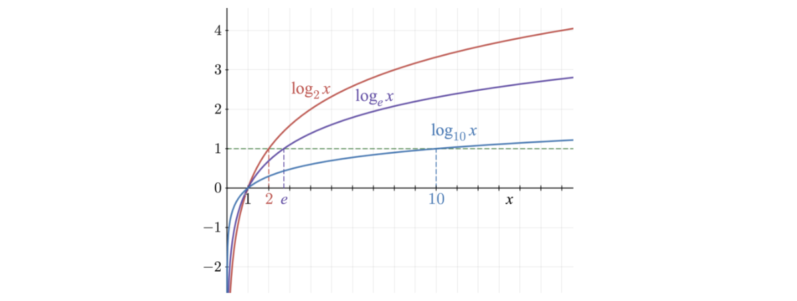
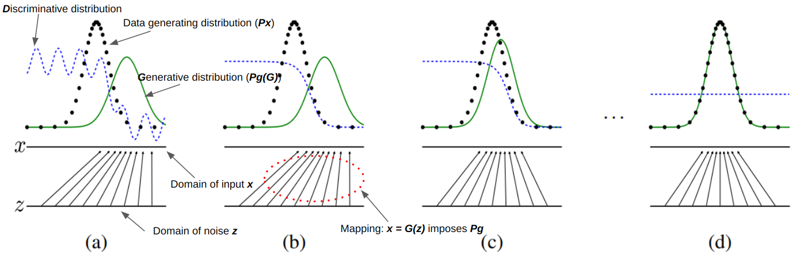
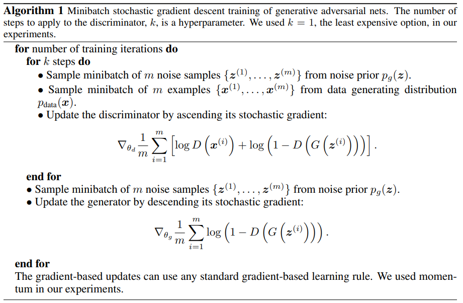

# GANs

> GANs (Generative Adversarial Nets) (2014) [[paper]](https://arxiv.org/pdf/1406.2661.pdf) [[Github]](https://github.com/goodfeli/adversarial)

## Introduction

GANs model is developed by _Ian Goodfellow_ and his colleagues in 2014. It consists two main components: a **generator** and a **discriminator**, they engage in a continuous game of competition, hence the term "adversarial."
- **Generative** model $G$ that captures the data distribution and creates realistic synthetic data samples. The object is mimic the distribution of the real data.
- **Discriminative** model $D$ that estimates the probability that if a sample came from the training data or $G$. It acts as a classifier, taking input from both the generator's output and real data samples, and learns to classify them as either real or fake.

#### Adversarial Nets  
In the framework, both models are multilayer perceptrons.   
Input data is $x$. Generator's distribution is $p_g$. Input noise variables $p_z(z)$. Mapping to data space is $G(z;\theta_g)$, where $G$ is a [differentiable function](https://en.wikipedia.org/wiki/Differentiable_function) represented by neural network with parameters $\theta_g$. Second neural network $D(x;\theta_d)$ outputs a single scalar, $D(x)$ represents the probability that $x$ came from the input data rather than $p_g$.  
The **training purpose** is to train $D$ to maximize the probability of assigning the correct label to the input data, train $G$ to minimize $\log(1-D(G(z)))$.  
The **value function** is $V(G,D)$:

$$
\min_G\max_D V(D,G)=\mathop{\mathbb{E}}_{x\sim p_{data}(x)}[\log{D(x)}]+\mathop{\mathbb{E}}_{z\sim p_{z}(z)}[\log{(1-D(G(z)))}]
$$

In the early learning, generator $G$ has poor behaviour and $D$ is easy to detect the samples come from $G$ instead of real data, so $D(G(z))\to0$, $1-D(G(z))\to1$, then $\log(1-D(G(z))\to0$ **saturates**, there may not a strong gradient propagating to the $G$. To fix the problem, modify the value function by training $G$ to maximize $\log{D(G(z))}$ instead, this way the logarithm has steep slope in $(0,1)$ that provides much stronger gradient in the early learning.   

> 

>  
saturates
 
>  "saturates" refers to a situation where the learning process has reached a plateau or a point where improvements are limited. This can happen when the generator or discriminator becomes too powerful, resulting in a lack of meaningful gradients for the other component to learn from.
> 

The $G$ and $D$ are trained simultaneously:

(a) A pair and adversarial nets near convergence: $p_g$ is similar to $p_{data}$, $D$ is partially accurate classifier.  
(b) $D$ is trained to discriminate samples from data, converging to $D^{*}(x)=\frac{P_{data}(x)}{P_{data}(x)+P_g(x)}.$  
(c) After updates to $G$, gradient of $D$ guides $G(z)$ flow to regions that are more likely to be classified as real data.  
(d) After training, if $G$ and $D$ have enough capacity, they will reach a point both models cannot improve because $p_g=p_{data}$. The $D$ is unable to differentiate between the two distributions so $D(x)=\frac{1}{2}.$  

#### Theoretical Results

